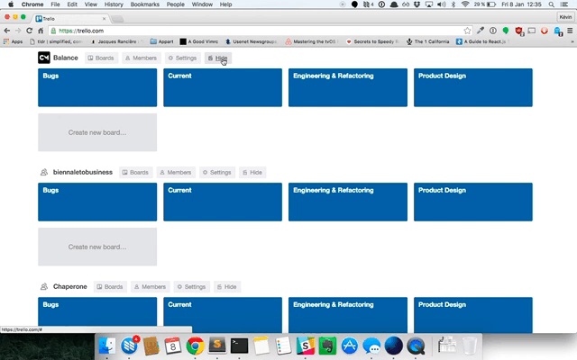

# Trello Archiver

## Why ?
At Craftsmen, we're creating a Trello Organization for each new project.
So we have a lot of organzations, and our Trello homepage starts to a big mess.
So we created Trello Archiver, a small plugin to add a Show / Hide feature for organizations with
data persistence using local storage.

## Contributing
Feel free to open issues, pull requests and fork.

## Licence
MIT
